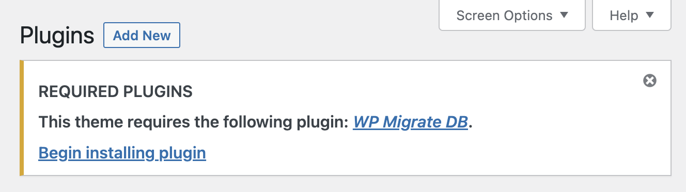

# WP Inquirist 🕵️
(<s>rename to: wp-themejson-plugins?</s>)

**Allow your theme to "inquire" about plugins!** This plugin uses the config file `theme.json` to recommended and require plugins within your WordPress theme. (Behind the scenes it takes advantage of [TGMPA](http://tgmpluginactivation.com/) to cause a new UI prompt to appear in the Plugins Page:




## How Does it Work?

This plugin searches your active theme directory for a JSON file and reads it's "plugins" array. *Note: Two formats are available because currently "plugins" is not a standard/valid node for theme.json, according to it's schema.*

1) `theme-plugins.json` (first choice) 
2) `theme.json` (second choice) 

```
{
    "plugins": [
        {
            "name": "WP Migrate DB",
            "required": true,
            "slug": "wp-migrate-db"
        }
    ]
}
```


## Compare with TGMPA
This array of objects recreates a PHP <a href="http://tgmpluginactivation.com/configuration/">data format</a> used by TGMPA - take special note of the named keys like `name|required|slug`:

```
$plugins = array(
    array(
        'name'      => 'WP Migrate DB',
        'required'  => true,
        'slug'      => 'wp-migrate-db'
    )
)
```


---

##  🔒 Private Plugins

Even though not all plugins are publicly visible you can still 1) Require them by name/slug 2) Link to the resource. This may require you to take *further steps* depending on the type of plugin to secure it. Once it's installed the need will have been met. 

---

## 🧨 Install with WP CLI
If you have the command-line tool [WP CLI](https://wp-cli.org/) you can quickly install this plugin with this command: `wp plugin install https://github.com/scottcarver/wp-inquirist/archive/refs/heads/main.zip --activate`
